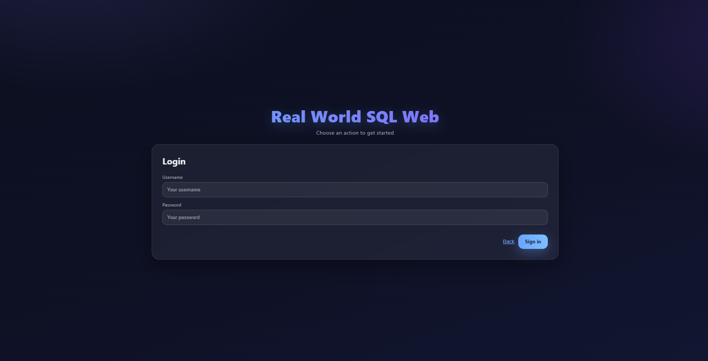
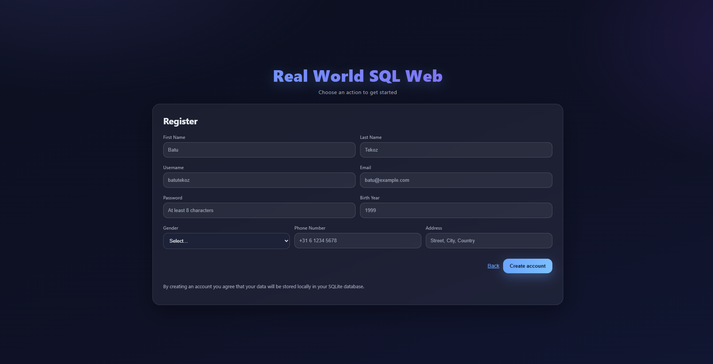
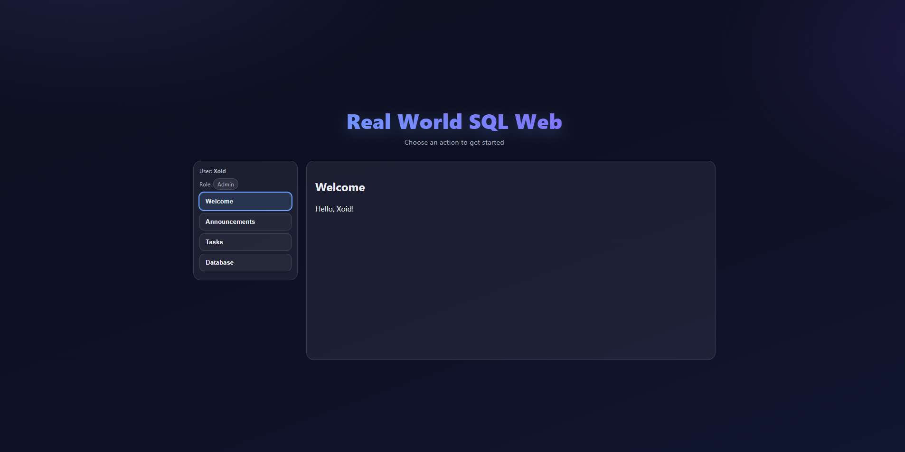
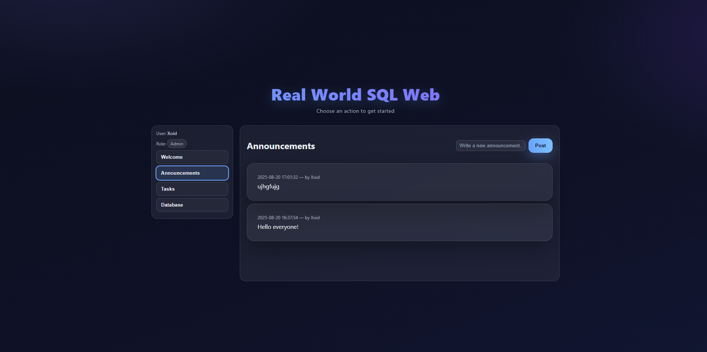
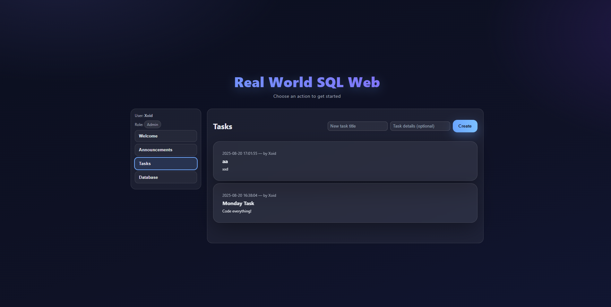
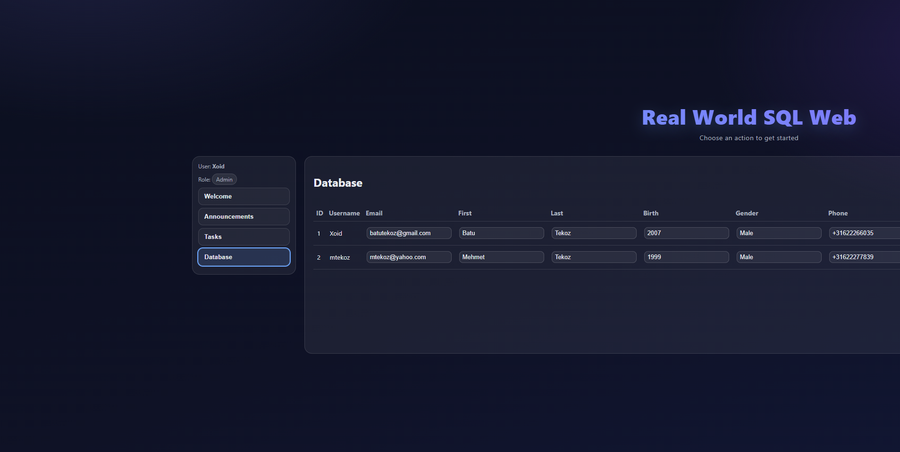

# Real World SQL Web
Real World SQL Web is a web-based application designed for corporate environments to send announcements to employees, assign and manage tasks, and maintain a centralized employee database.

## Features
- Deliver announcement messages to employees  
- Assign and track work tasks  
- Manage employee data in a centralized database  

## 📸 Screenshots

### Login Page


### Register Page


### Welcome Dashboard


### Announcements


### Tasks


### Employee Database


## Getting Started

### 1. Install Git
Download and install Git:  
[Git for Windows – Latest Release](https://github.com/git-for-windows/git/releases/download/v2.50.1.windows.1/Git-2.50.1-64-bit.exe)

### 2. Setup VCPKG & Dependencies
Open **CMD** and run:
```bash
git clone https://github.com/microsoft/vcpkg.git
cd vcpkg
.\bootstrap-vcpkg.bat
.\vcpkg integrate install
.\vcpkg install crow:x64-windows sqlite3:x64-windows sqlite-modern-cpp:x64-windows
```

### 3. Configure in Visual Studio
- Open your project in **Visual Studio Community**  
- Go to **Project → Properties**  
- Under **Configuration Properties → vcpkg**, set **Use Vcpkg** to **Yes**  

## Building the Project
1. Open the solution in Visual Studio  
2. Build the project (`Ctrl + Shift + B`)  
3. Run the executable from `x64/Release`  
4. Launch **Real World SQL Web.exe**  

## License
This project is licensed under the **MIT License** – see the LICENSE file for details.  

## Contributing
Pull requests are welcome! Feel free to open issues for bugs, feature requests, or ideas.  

## Credits
- **C++** – Core language  
- **HTML & CSS** – Front-end design and layout  
- **Crow** – Lightweight C++ web framework  
- **SQLite** – Database management  
- **Visual Studio** – Development environment  
